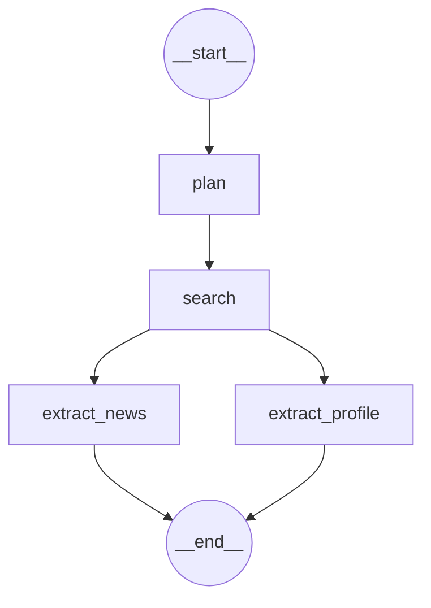

# News Intelligence Agent

AI-Based External News Intelligence Agent — verilmiş bir şirkət (ad + ölkə + sektor)
üçün son xəbərləri avtomatik toplayıb təhlil edən və eyni zamanda mənbələrdən
strukturlaşdırılmış, mənbə-linkli bir şirkət profili çıxaran, [LangGraph](https://github.com/langchain-ai/langgraph)
üzərində qurulmuş agentic pipeline. Nəticələr Streamlit UI-da kart formatında
göstərilir, bütün LLM çağırışları [Langfuse](https://langfuse.com) ilə trace olunur.

## Məzmun

- [Arxitektura](#arxitektura)
- [UI](#ui)
- [Layihə strukturu](#layihə-strukturu)
- [Quraşdırma](#quraşdırma)
- [Mühit dəyişənləri](#mühit-dəyişənləri)
- [Texnologiyalar](#texnologiyalar)

## Arxitektura

Pipeline 4 node-dan ibarətdir. `plan → search` ardıcıl işləyir, `search`
bitdikdən sonra `extract_news` və `extract_profile` eyni `raw_results`-u oxuyub
paralel işləyir:



- **`plan`** — 13 profil kateqoriyası üçün axtarış sorğuları qurur.
- **`search`** — Tavily API ilə son xəbərləri və profil kateqoriyalarının
  nəticələrini tapır.
- **`extract_news`** — xəbərləri sentiment, kateqoriya, xülasə və əlaqəlilik
  baxımından təhlil edir.
- **`extract_profile`** — axtarış nəticələrindən strukturlaşdırılmış, mənbə-linkli
  şirkət profili çıxarır.

Bütün pipeline tək bir Langfuse trace-i altında işə salınır — hər node, hər LLM
çağırışı (prompt, token sayı, xərc daxil olmaqla) Langfuse UI-da bir-birinin
altında, nest olunmuş şəkildə görünür.

## UI

Streamlit UI (`test_app.py`) axtarış parametrlərini sol paneldə alır: şirkət
adı, ölkə, sektor (opsional), neçə günlük xəbər axtarılsın, maksimum xəbər sayı.


Profil sahələri kart formatında göstərilir — kartda yalnız konkret fakt
(`value`) görünür, üzərinə gələndə (hover) ətraflı xülasə açılır, sağ yuxarı
küncdəki 🔗 ikonu məlumatın mənbəsini yeni tab-da açır. Xəbərlər tarixə görə
(yenidən köhnəyə) sıralanır.

## Layihə strukturu

```
.
├── pipline.py       # LangGraph qrafının qurulması və run_pipeline()
├── plan.py          # plan node — profil sorğularının qurulması
├── search.py        # search node — Tavily API inteqrasiyası
├── extract.py       # extract_news / extract_profile node-ları
├── state.py         # NewsIntelState və Pydantic sxemaları
├── call_model.py    # LLM client (Google Gemini) + Langfuse konfiqurasiyası
├── test_app.py       # Streamlit UI
├── assets/           # README-dəki şəkillər
└── raw_results/       # search_node-un JSON çıxışları (repo-ya commit olunmur)
```

## Quraşdırma

1. Asılılıqları quraşdır:
   ```bash
   pip install -r requirements.txt
   ```
2. Kök qovluqda `.env` faylı yarat (aşağıdakı cədvələ bax).
3. UI-ni işə sal:
   ```bash
   streamlit run test_app.py
   ```
4. Mənual test üçün (Streamlit-siz):
   ```bash
   python pipline.py
   ```

## Mühit dəyişənləri

| Dəyişən | Məcburi | Təsviri |
|---|---|---|
| `TAVILY_API_KEY` | Bəli | Tavily web axtarış API açarı |
| `MODEL_PROVIDER` | Xeyr (default `google_genai`) | LangChain model provayderi |
| `MODEL_NAME` | Xeyr (default `gemini-2.5-flash`) | İstifadə olunacaq model |
| `MODEL_TEMPERATURE` | Xeyr (default `0.0`) | Model temperature |
| `MODEL_MAX_TOKENS` | Xeyr (default `8192`) | Maksimum çıxış token sayı |
| `LANGFUSE_PUBLIC_KEY` | Bəli | Langfuse public açarı |
| `LANGFUSE_SECRET_KEY` | Bəli | Langfuse secret açarı |
| `LANGFUSE_BASE_URL` | Xeyr | Langfuse host (EU/US/self-host) |
| `RAW_RESULTS_DIR` | Xeyr (default `raw_results`) | `raw_results` JSON-larının saxlanacağı qovluq |

## Texnologiyalar

- **LangGraph** / **LangChain** — pipeline orkestrasiyası
- **Google Gemini** (`google_genai`) — LLM
- **Tavily API** — web axtarışı
- **trafilatura** — məqalə tam mətninin çıxarılması
- **Langfuse** — LLM observability/tracing (OTEL-əsaslı)
- **Streamlit** — UI
