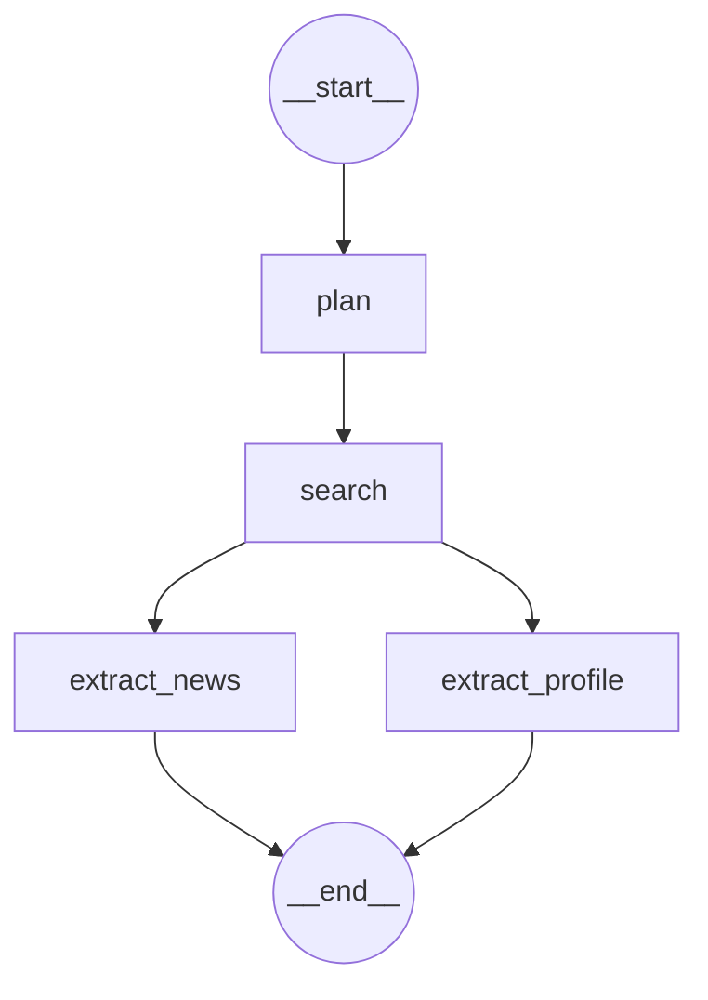

# News Intelligence — AI-Based External News Intelligence Agent

Verilmiş bir şirkət (ad + ölkə + sektor) üçün son xəbərləri toplayıb təhlil edən və
qısa, strukturlaşdırılmış bir şirkət profili çıxaran, LangGraph üzərində qurulmuş
agentic pipeline. Nəticələr Streamlit UI-da kart formatında göstərilir.

## Necə işləyir

Pipeline 4 node-dan ibarətdir və `plan → search` ardıcıl, `search`-dan sonra
`extract_news` və `extract_profile` paralel şəkildə işləyir:



- **`plan`** — 13 profil kateqoriyası (kimlik, yaranma tarixi, rəhbərlik, maliyyə,
  risk və s.) üçün axtarış sorğuları qurur. Struktur sabit template-dəndir (LLM
  iştirakı yoxdur), hər kateqoriya üçün 2 sorğu istehsal olunur: ingiliscə (kanonik)
  + şirkətin ölkəsinin əsas dilində (LLM tərcüməsi, ölkə üzrə keşlənərək).
- **`search`** — Tavily API ilə (a) son xəbərləri (`topic="news"`) və (b) 13 profil
  kateqoriyasının sorğularını (`topic="general"`) axtarır. Ölkəyə görə əhatə zəif
  çıxarsa, avtomatik domen-məhdud axtarışa (`include_domains`, manual seed + dinamik
  kəşf) keçir. Nəticələr `raw_results/` qovluğuna JSON kimi də saxlanılır.
- **`extract_news`** — tapılan xəbərləri 5-lik batch-lərə bölüb, hər batch-i tək LLM
  çağırışında (paralel, `ThreadPoolExecutor` ilə) təhlil edir: sentiment, kateqoriya,
  xülasə, təsir və əlaqəlilik (`is_relevant`).
- **`extract_profile`** — 13 kateqoriyanın axtarış nəticələrini ümumiləşdirib hər
  sahə üçün konkret fakt (`value`), ətraflı təsvir (`xülasə`) və mənbə linki
  (`mənbə`) çıxarır.

Bütün pipeline Langfuse ilə tam trace olunur (hər LLM çağırışı, token sayları,
xərc daxil olmaqla).

## UI

Streamlit UI axtarış parametrlərini (şirkət adı, ölkə, sektor, gün aralığı,
maksimum xəbər sayı) sol paneldə alır, nəticəni kart formatında göstərir — hər
kartın üzərinə gələndə (hover) ətraflı xülasə açılır, sağ yuxarı küncdəki 🔗 ikonu
məlumatın götürüldüyü mənbəni açır.


## Layihə strukturu

```
.
├── pipline.py        # LangGraph qrafının qurulması və run_pipeline()
├── plan.py           # plan node — profil sorğularının qurulması
├── search.py         # search node — Tavily API inteqrasiyası
├── extract.py         # extract_news / extract_profile node-ları
├── state.py           # NewsIntelState və Pydantic sxemaları
├── call_model.py       # LLM client (Google Gemini) + Langfuse konfiqurasiyası
├── test_app.py         # Streamlit UI
└── raw_results/         # search_node-un JSON çıxışları (repo-ya commit olunmur)
```

## Quraşdırma

1. Asılılıqları quraşdır:
   ```bash
   pip install -r requirements.txt
   ```
2. Kök qovluqda `.env` faylı yarat:
   ```env
   TAVILY_API_KEY=...
   MODEL_PROVIDER=google_genai
   MODEL_NAME=gemini-3.5-flash-lite
   LANGFUSE_PUBLIC_KEY=pk-lf-...
   LANGFUSE_SECRET_KEY=sk-lf-...
   LANGFUSE_BASE_URL=https://cloud.langfuse.com
   ```
3. UI-ni işə sal:
   ```bash
   streamlit run test_app.py
   ```

## Texnologiyalar

- **LangGraph** / **LangChain** — pipeline orkestrasiyası
- **Google Gemini** (`google_genai`) — LLM
- **Tavily API** — web axtarışı
- **Langfuse** — LLM observability/tracing
- **Streamlit** — UI
